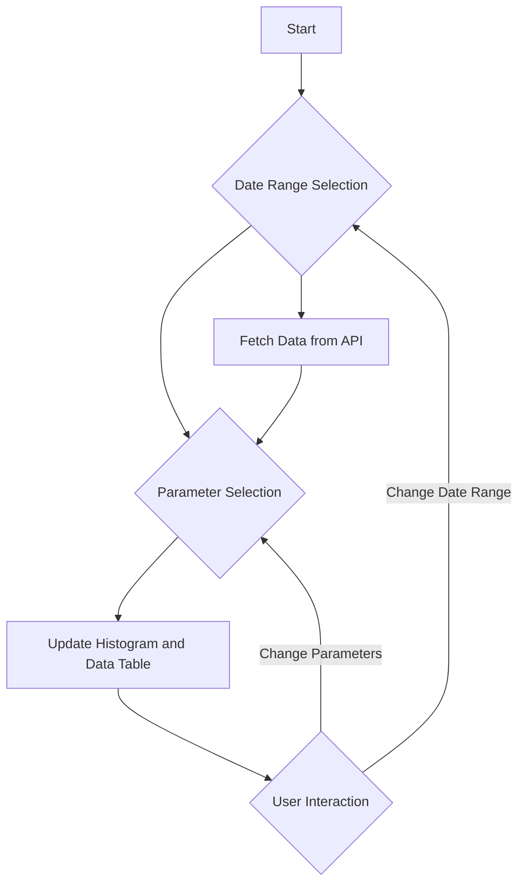

Pitt County Air quality Data Analysis App

This Dash application provides interactive data visualization and analysis capabilities for air quality data in Pitt county. Users can select a date range and parameters of interest to visualize the arithmetic means of these parameters over time through histograms and view the corresponding data in a table.
App Workflow

 python
Features

    Date Range Selection: Allows users to filter the dataset within a specific time frame.
    Parameter Selection: Users can select specific parameters for which they want to analyze the data.
    Data Visualization: Interactive histograms display the arithmetic means of the selected parameters over the chosen time range.
    Data Table: A detailed view of the filtered dataset is available in a tabular format.

Components

    DatePickerRange: Enables users to select the start and end dates for the data they wish to analyze.
    Dropdown: Allows for the selection of parameters to be visualized.
    Graph: Displays histograms based on the selected parameters and date range.
    DataTable: Shows the filtered data based on the user's selections.
    Tabs: Organize the visualization and data table for better user experience.

Data Fetching

Data is fetched from an external API based on the user's date range selection. The parameters available for selection are dynamically updated based on the fetched data.
User Interaction Flow

    The user selects a date range.
    The application fetches data corresponding to the selected date range.
    Parameters available for selection are updated based on the fetched data.
    The user selects parameters to visualize.
    The application updates the histogram and data table based on the selected parameters.
    Users can interact with the visualization and data table, adjusting their selections as needed.
